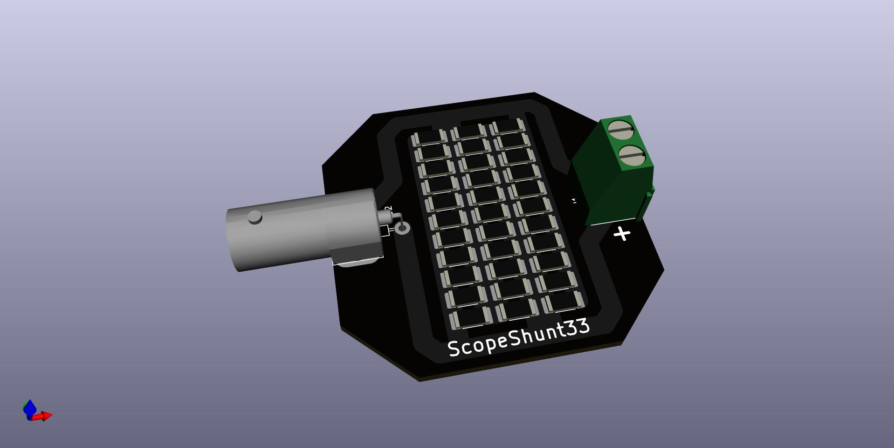

# ScopeShunt33

BOM https://www.digikey.com/short/n542tnnq

PCB https://www.pcbway.com/project/shareproject/ScopeShunt33_095d5357.html

Be careful soldering the BNC connector. The solid metal body sinks the heat away from the two main legs and makes it difficult to get the legs hot enough to solder, and then by the time you do get them hot enough, the body has heated up to the point where the insulation is melting inside.

For the two main legs, use a large tip with the heat turned up over 400C, and heat the tips of the legs on the bottom side of the pcb as fast as possible, solder, and get out of there and stop adding heat as fast as possible before the rest of the connector heats up and the insulation melts. Don't try to get the solder to flow all the way to the top side of the pcb.

# History / Credits
Inspired by https://github.com/voltlog/ScopeShunt
