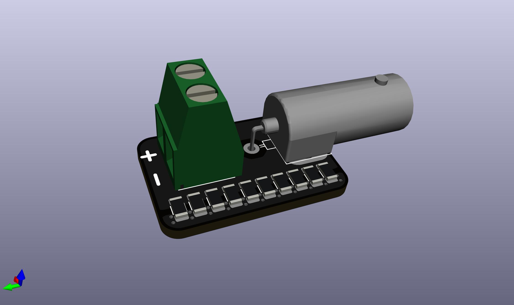
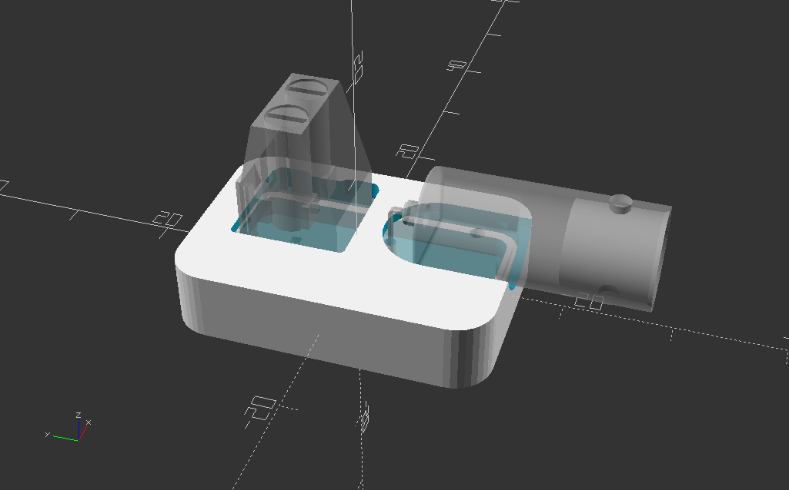

# ScopeShuntX

BOM https://www.digikey.com/short/3z3bj7z3

PCB https://www.pcbway.com/project/shareproject/ScopeShunt33_095d5357.html

PCB Gerbers & Enclusure STLs in [RELEASES](../../releases/)

# Resistor Values -> Current Ranges -> Scope Readings
The BOM above includes 10 mOhm resistors, which makes a shunt suitable for measuring 1A to 100A (Really only about 20A, see (2) below), which is mostly suitable for automotive work.

To measure other current ranges, substitute one of these other resistors instead.  
Remember in all cases to use:  
 * qty 10 resistors (a few spares is recommended also, but the PCB needs 10)  
 * 1206 size (normal, not "wide" orientation)  
 * 1% tolerance or less  
 * Recommend to use the highest power rating you can get, to make it less likely to destroy when accidentally connected to too-high current  

<!-- general search, all resistances https://www.digikey.com/short/wwhwwcjd -->

 | Individual Resistors | Total Resistance | Current Range | Scope Reading | Catasrophic Failure |
 | --- | --- | --- | --- | --- |
 | [10 kOhm 1 W](https://www.digikey.com/short/cfbp8cz7) | 1 kOhm | 100 uA | 1 mV = 1 uA | 100mA 100V |
 | [1 kOhm 3/4 W](https://www.digikey.com/short/vp9hpb5z) | 100 Ohm | 1 mA | 1 mV = 10 uA | 270mA 27V (1) |
 | [100 Ohm 1 W](https://www.digikey.com/short/dbw91twt) | 10 Ohm | 10 mA | 1 mV = 100 uA | 1A 10V |
 | [10 Ohm 1 W](https://www.digikey.com/short/b54bzdjr) | 1 Ohm | 100 mA | 1 mV = 1 mA | 3A 3V |
 | [1 Ohm 3/4 W](https://www.digikey.com/short/f9hpctpn) | 100 mOhm | 1 A | 1 mV = 10 mA | 8.6A 860mV (1) |
 | [100 mOhm 1 W](https://www.digikey.com/short/brpqvpnv) | 10 mOhm | 10 A | 1 mV = 100 mA | 30A 300mV (2) |
 | [10 mOhm 1 W](https://www.digikey.com/short/mjnfq7dt) | 1 mOhm | 100 A | 1 mV = 1 A | 100A 100mV (2) |

 (1) Reflects the listed 3/4W resistors because 1W not available. Would be a little higher with 1W parts.

 (2) The practical current limit is much lower for a few reasons. In decreasing order:

 * This design uses size 1206 resistors, which aren't available in power ratings over 1W. 100A would be 100% of the resistors rated capacity, which they can't actually sustain for long. If the resitors were the only consideration, then the practical limit would be more like 75A for continuous use, 100A for brief periods  
 * The PCB uses zone fills rather than traces for all connections, so it's difficult to calculate the max current the PCB traces can carry. Here is a table based on 4mm wide traces x 2 traces per pin. The PCB has significantly more copper than this, and can probably handle significantly more than these values.  
 | CU Oz | Amps +10°C | Amps +45°C |
 | --- | --- | --- |
 | 1 | 6.4 | 13 |
 | 2 | 10  | 20 |
 | 3 | 13.5 | 27.5 |
 TL,DR: If you're going to be routinely measuring over 10A, be sure to oder the PCB with 2oz copper or more.

 * The terminal block is only rated for 16A

# History / Credits
Inspired by https://github.com/voltlog/ScopeShunt
